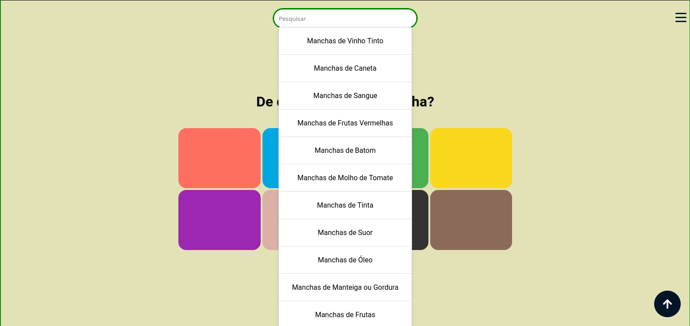

# ManchouLimpou

ManchouLimpou é um aplicativo web em **React JS** que ajuda a identificar e tratar manchas em tecidos de forma prática e interativa.

## Funcionalidades

- Seleção de cor da mancha pelo usuário
- Perguntas para identificar o tipo da mancha
- Sugestões detalhadas de como remover cada tipo de mancha
- Design responsivo e interface amigável
- Pseudo-API que alimenta um aplicativo mobile com os mesmos dados
- Pesquisa e indexação de todos os guias
- Guias atualizaveis em Markdown
- Projeto escalável

  

## Tecnologias

- React JS
- CSS customizado
- Pseudo-API para integração mobile

# Sobre o Autor

Todo o design, desenvolvimento e implementação das funcionalidades foram realizados pelo autor.

# Observações

Este projeto é uma demonstração de habilidades em React JS, manipulação de estado, criação de componentes, design responsivo e integração com pseudo-API para fins de aprendizado e portfólio.
